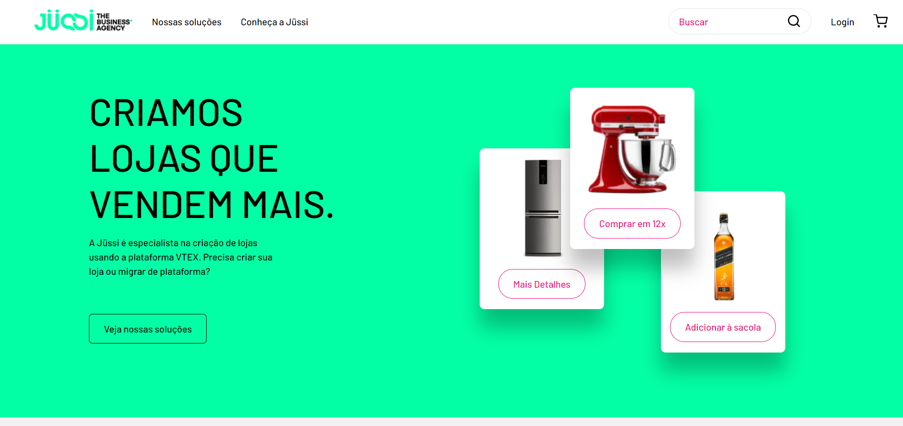
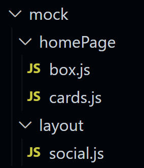

# Desafio Jüssi



## Veja o projeto!
Confira a plataforma hospedada [aqui](https://desafio-jussi.vercel.app/)<br />
Caso deseje rodar o projeto em sua maquina, clone o projeto e rode os comandos
```
yarn
```
```
yarn dev
```
<br />

## Case
Desenvolver um e-commerce baseado em um [Figma](https://www.figma.com/file/O9AEeYB6ZWyMTZzMZhvjaY/loja-vtex-jussi?node-id=0%3A1) que cumpra as seguintes promissas:
  - Usar o React como biblioteca base do projeto;
  - Usar alguma API pública de consulta para o campo de busca no header;
  - Ao finalizar o projeto, publique no seu repositório no Github e nos envie a URL para acesso;
<br /><br />

## Sobre a solução
  - Foi escolhida a framework react [NextJS](https://nextjs.org/) para desenvolver a plataforma.
  - A página principal está responsiva para versões mobile.
  - A API escolhida para consulta foi a de personagens de [Star Wars](https://swapi.dev/).
  - O valor retornado da API fica salvo em no context do projeto.
  - Foram criados dados mockados para reduzir o tamanho das páginas e torna-lás dinamicas. 

<br /><br />

### Espero que tenha gostado do resultado 😀
Deustavo.

